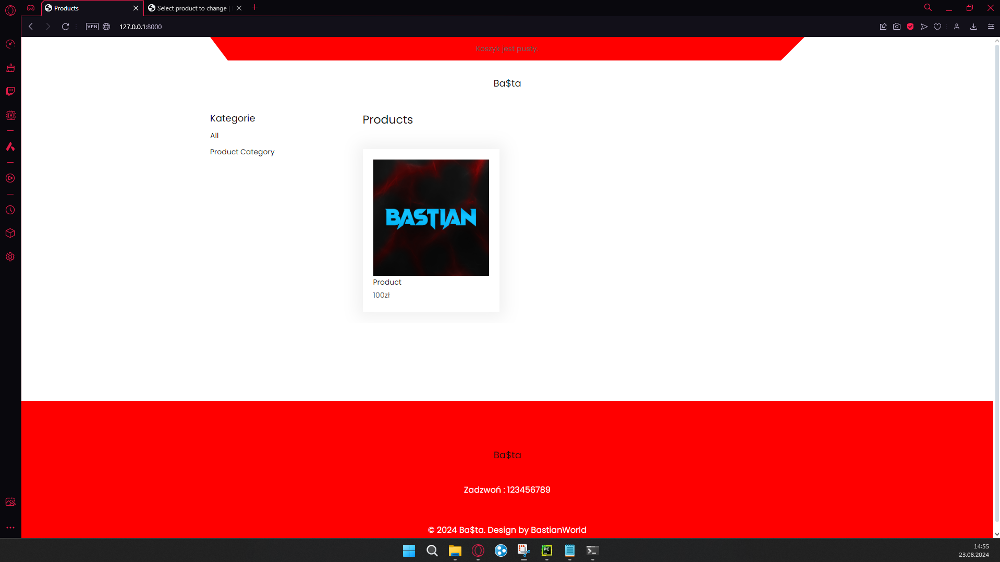

<h1>BaStore</h1>

BaStore to aplikacja internetowa do zarządzania sklepem online. Projekt ten został stworzony z pomocą kursu na youtube oraz w celu ułatwienia procesu sprzedaży produktów i zarządzania zamówieniami dla sklepów online.

<h2>Funkcjonalności</h2>
<ul>
    <li>Zarządzanie produktami i ich cenami</li>
    <li>Zarządzanie zamówieniami i ich statusami</li>
    <li>Zarządzanie klientami i ich danymi</li>
    <li>Wyszukiwanie produktów i zamówień</li>
</ul>

<h2>Technologie</h2>
<ul>
    <li>Django 3.x</li>
    <li>Python 3.x</li>
</ul>

<h2>Instalacja</h2>
<ol>
    <li>Sklonuj repozytorium: <code>git clone https://github.com/Bastian8004/BaStore.git</code></li>
    <li>Zainstaluj zależności: <code>pip install -r requirements.txt</code></li>
    <li>Uruchom serwer: <code>python manage.py runserver</code></li>
    <li>Otwórz przeglądarkę i przejdź do adresu <a href="http://localhost:8000/">http://localhost:8000/</a></li>
</ol>

<h2>Użycie</h2>
<ol>
    <li>Zaloguj się do systemu jako administrator</li>
    <li>Dodaj produkty i ustal ich ceny</li>
    <li>Zarządzaj zamówieniami i ich statusami</li>
    <li>Wyszukaj produkty i zamówienia</li>
</ol>

<h2>Dalszy rozwój</h2>

Projekt BaStore jest w ciągłym rozwoju. Planowane są następujące funkcjonalności:

<ul>
    <li>Dodanie funkcji płatności online</li>
    <li>Rozszerzenie systemu zarządzania zamówieniami</li>
    <li>Dodanie funkcji wysyłania powiadomień o statusie zamówienia</li>
</ul>

<h2>Poniżej zdjęcia projektu z widoku przeglądarki:</h2>

<h5>Lista produktów na stronie</h5>

<h5>Szcegółowa strona produktu</h5>

<h5>Widok koszyka</h5>

<h5>Widok zamówienia i wypełnienia danych</h5>

