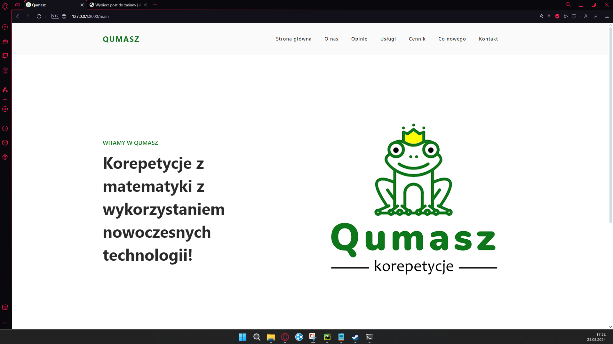
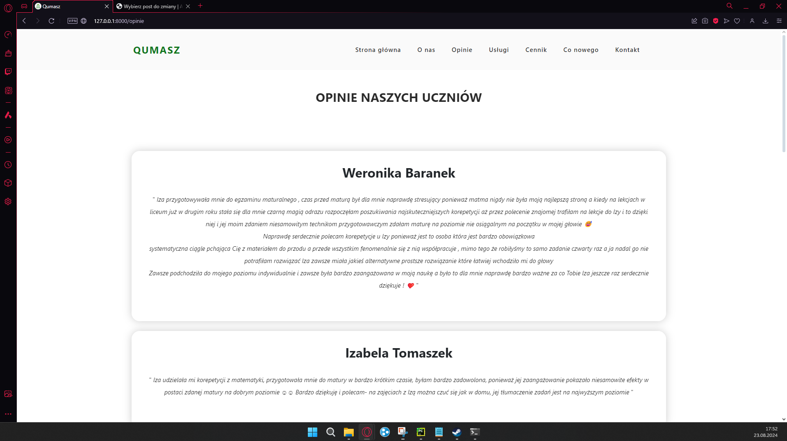
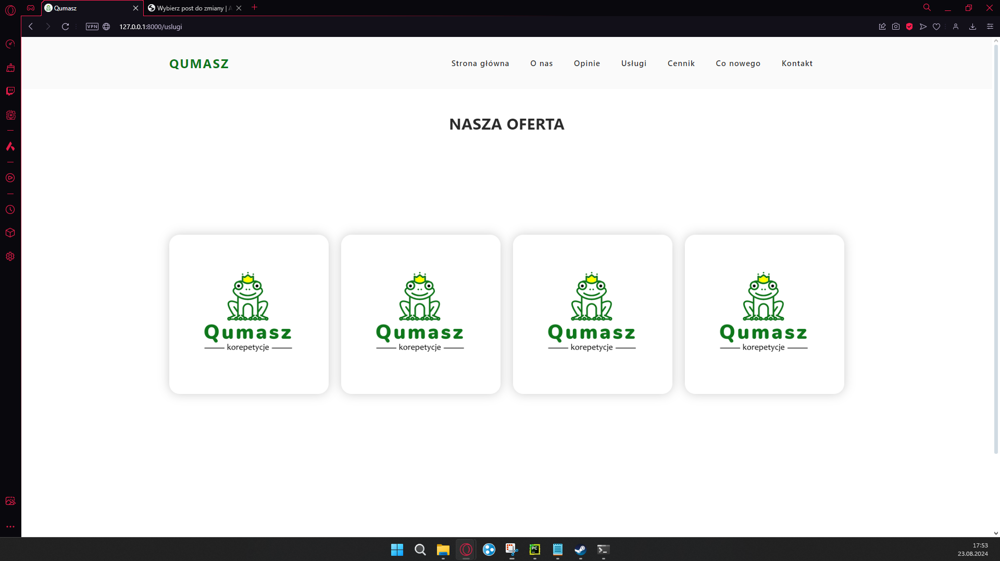
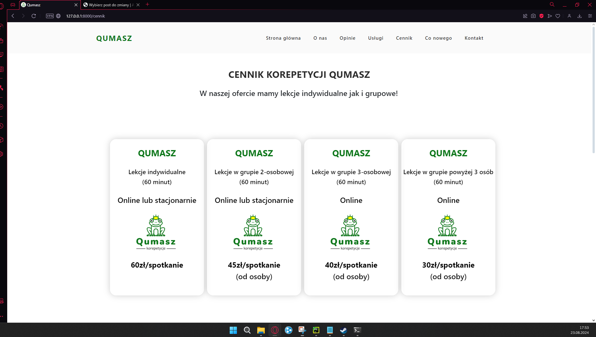
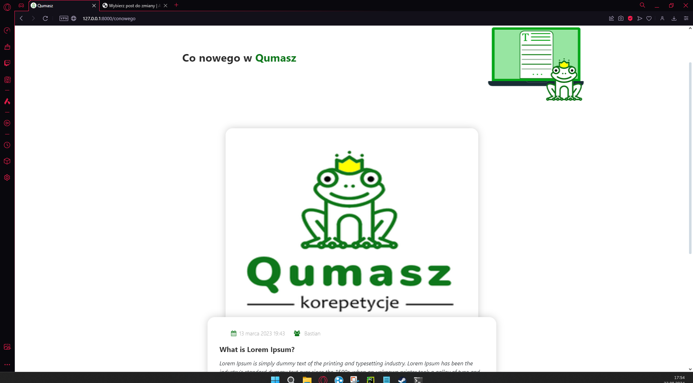
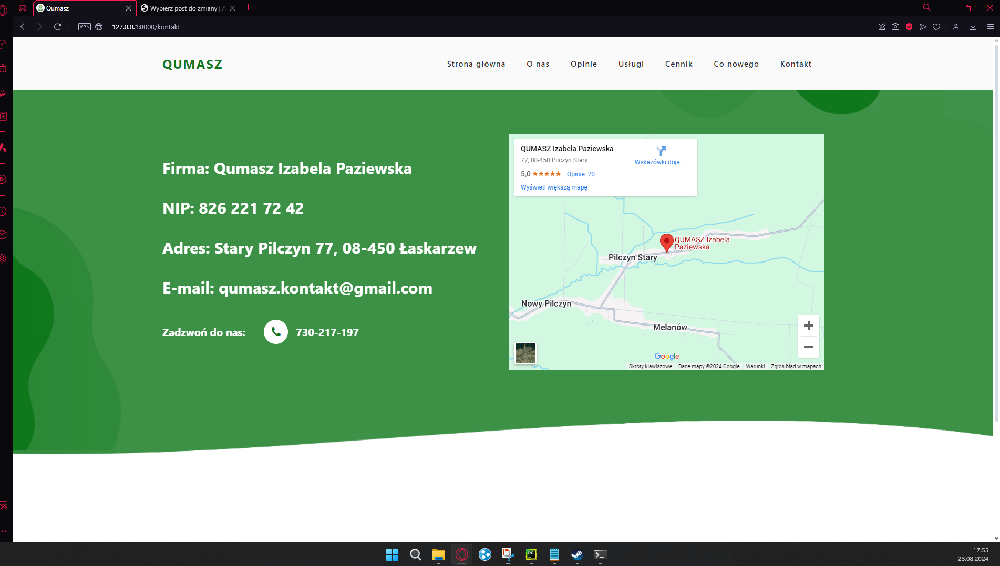
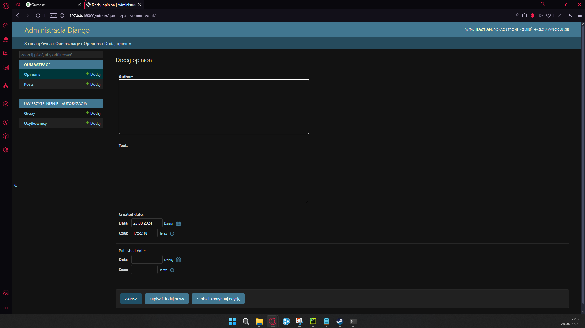
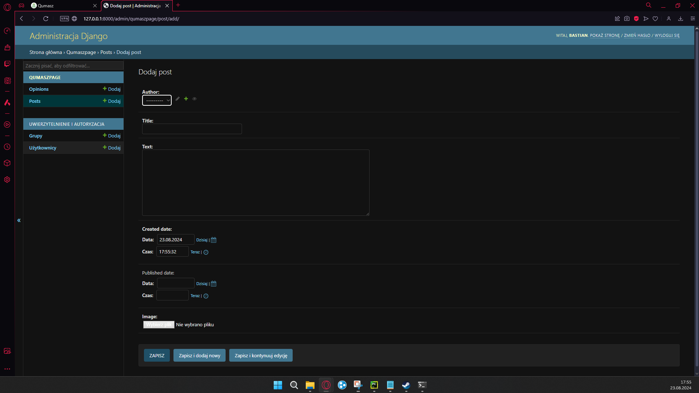

<h1>Qumasz</h1>

Qumasz to strona zrobiona na zlecenie dla firmy od korepetycji z matematyki, która pozwala firmie na dodawanie opinii z google oraz prowadzenie bloga.

<h2>Funkcjonalności</h2>
<ul>
    <li>Dodawanie opinii z google</li>
    <li>Prowadzenie bloga</li>
</ul>

<h2>Technologie</h2>
<ul>
    <li>Django 3.x</li>
    <li>Python 3.x</li>
</ul>

<h2>Poniżej znajdują się zdjęcia z wiidoku przeglądarki</h2>

<h4>Widok strony startowej</h4>

<h4>Strona z opiniami</h4>

<h4>Widok strony z ofertą</h4>

<h4>Strona z cennikiem</h4>

<h4>Widok bloga firmy</h4></h4>

<h4>Strona z informacjami</h4>

<h4>Widok z panelu administracyjnego - dodawanie opinii</h4>

<h4>Widok z panelu administracyjnego - dodawanie postów na bloga</h4>

